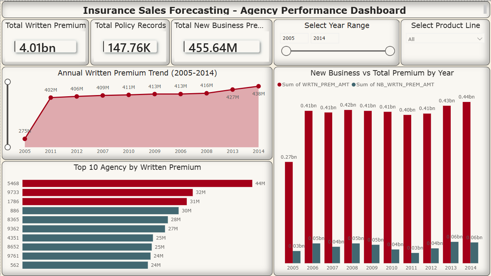
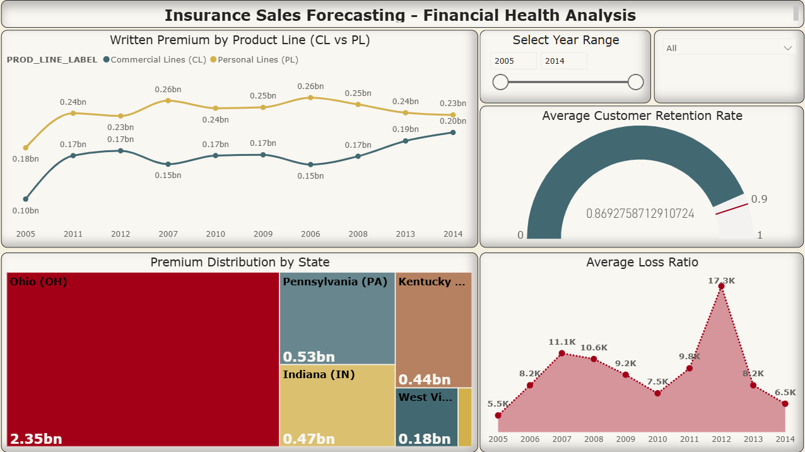
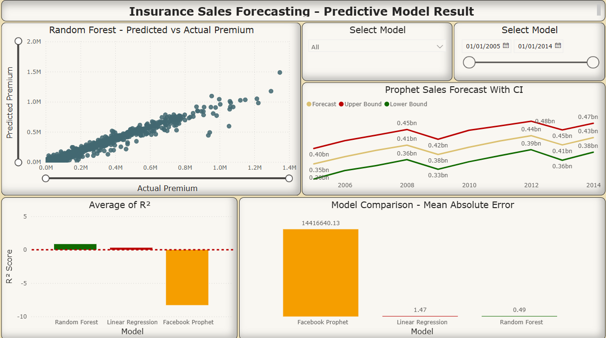
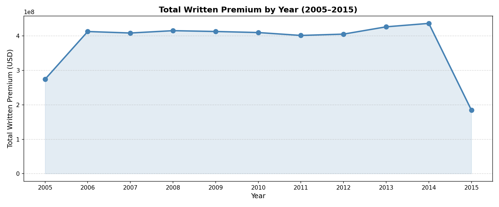
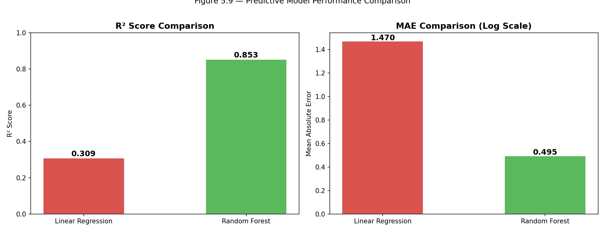
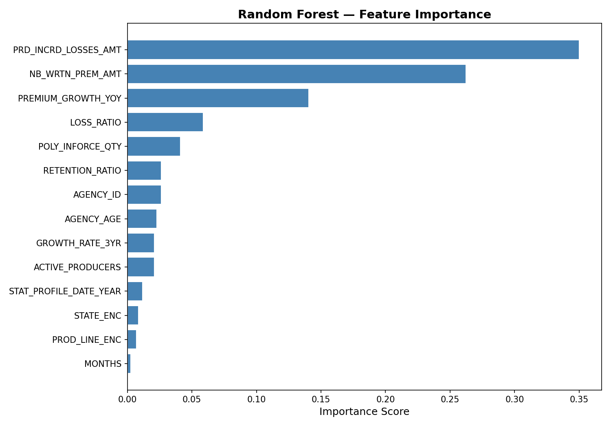

# Predictive Analytics for Insurance Sales Forecasting

## 📌 Project Overview
This project applies predictive analytics to forecast insurance sales 
(written premium) using historical agency performance data from a 
regional US insurance group covering 2005–2014.

## 🎯 Objectives
- Analyze 11 years of insurance sales and financial indicators
- Build and compare predictive models for sales forecasting
- Evaluate model accuracy using MAE, RMSE, and R² metrics
- Provide data-driven recommendations for the finance sector

## 📊 Dataset
- **Source:** Kaggle — Insurance Agency Performance Dataset
- **Records:** 213,328 (147,760 after cleaning)
- **Features:** 49 columns | 1,623 agencies | 6 states | 10 product types
- **Time Period:** 2005–2015

## 🔧 Tools & Technologies
| Tool | Purpose |
|---|---|
| Python (Pandas, NumPy) | Data processing & analysis |
| Scikit-learn | Machine learning models |
| Facebook Prophet | Time-series forecasting |
| Matplotlib / Seaborn | Data visualization |
| SQLite + SQL | Data querying & aggregation |
| Power BI | Interactive dashboard |

## 🤖 Models Built
| Model | MAE | RMSE | R² |
|---|---|---|---|
| Linear Regression | 1.470 | 1.830 | 0.309 |
| Random Forest | 0.505 | 0.858 | **0.848** |
| Facebook Prophet | - | - | Time-series trend |

✅ **Best Model: Random Forest Regressor (R² = 0.848)**

## 🔑 Key Findings
- Incurred losses (`PRD_INCRD_LOSSES_AMT`) is the strongest predictor of premium volume
- New business written premium (`NB_WRTN_PREM_AMT`) is the second most important feature
- Ohio accounts for 58% of total written premium across the portfolio
- Commercial Lines grew from $95M to $204M (2005–2014), a 114% increase
- Average customer retention rate across all agencies: 88.75%

```
## 📁 Project Structure
insurance_sales_forecasting/
├── data/
│   ├── raw/               # Original dataset
│   └── processed/         # Cleaned data, train/test splits
├── powerbi/
│ └── insurance_sales_forecasting.pbix
├── notebooks/
│   ├── 01_data_exploration.ipynb
│   ├── 02_preprocessing_modeling.ipynb
│   └── 03_sql_queries.ipynb
├── reports/               # All charts, figures and pdf
├── sql/
└── README.md
```

## Power BI Dashboards
Sales Overview Dashboard





## Sample Visualizations




## 🔗 Portfolio
- **GitHub:** https://github.com/maanajipriyanshu
- **LinkedIn:** https://www.linkedin.com/in/maanapriyanshurajput/
- **Previous Project:** (https://github.com/maanajipriyanshu/india-job-market-analysis)
